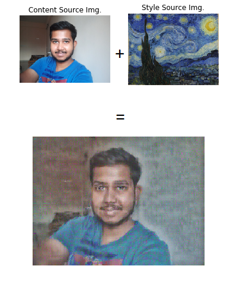
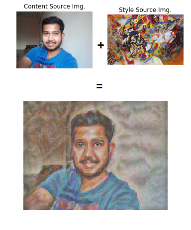
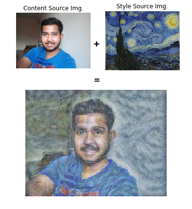
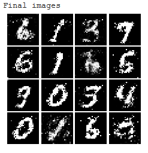
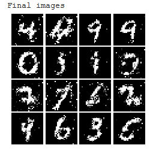
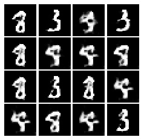

# GAN Assignment

## Samvram Sahu, Arnab Karmakar

A solution to Assignment of AV494 assignment. This is for course fullfilment of AV-494 at IIST by Dr. Deepak Mishra.

The goals of this assignment are as follows:

* Understand and implement techniques for image style transfer.
* Understand how to train and implement a Generative Adversarial Network (GAN) to produce images that resemble samples from a dataset.

## Codes

The code for style transfer can be found [here](https://github.com/samvram/gan_cs231n/blob/master/assignment3/StyleTransfer-TensorFlow.ipynb).

The code for style transfer for custom images can be found [here](https://github.com/samvram/gan_cs231n/blob/master/assignment3/StyleTransfer-TensorFlowSam.ipynb).

The code for the GAN implementation can be found [here](https://github.com/samvram/gan_cs231n/blob/master/assignment3/GANs_TensorFlow_Collaboratory.ipynb).

## Results

### Style Transfer

Inverse Style Transfer

Forward Style Transfer 1

Forward Style Transfer 2

### GAN

Normal GAN

Least Square GAN

DC GAN
